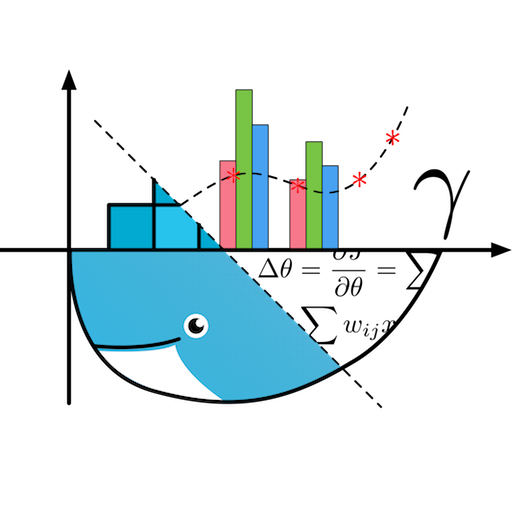

# Data Science Docker (DSD)



DSD is a Docker manager for data science users on a host machine.
It provide each user an independent environment and allow users to share the computational resources on the host without disturbing other users.
The provided environment is simple but powerful, with which users can work on their data science project right away.
It also integrate management of NVidia GPU resources for easy and independent access.

## NOTICE

This project is still under development.
Before any update, make sure your repository is up-to-date.

## Usage

DSD console works in a Docker container by default.
The simplest way is to start from the provided script as follows.
```
bash dsd/docker/dsd/run.sh
```
A container will be created for DSD console at runtime with proper access to the host API.
The script will promote to require `sudo` privilege.
Follow the promoted links to visit DSD service.

Enjoy and report any issue to us.

## Developer Guide

We use a fork & pull-request workflow.
Every developer fork the baseline repository [`dsddev/dsd`](https://git.oschina.net/dsddev/dsd) and develop on his/her own repository.
After certain progresses being made, submit a pull-request to the baseline repository.
We appreciate any contribution to this project.

Following are basic steps to work on the code.

1. Fork the baseline repository.

2. Clone your own repository to a local working directory.
```
git clone git@git.oschina.net:<your_name>/dsd.git
```
You may need this [instruction](https://git.oschina.net/oschina/git-osc/wikis/%E5%B8%AE%E5%8A%A9#ssh-keys) if this is your first go on [`git.osc`](https://git.oschina.net).

3. Pull from the baseline repository to your own repository to keep it up-to-date.
You can use the "sync" button on the [web interface](https://git.oschina.net/<your_name>/dsd).

4. Change to your local working directory. Pull from your own repository to the local working directory.
```
cd </path/to/>dsd
git pull
```

5. Resolve conflict if there is any, and commit for the merge of course.

6. Start working with your code. You do that right in the container for DSD console in development mode.

    1. Start the DSD console container in development mode
    ```
    bash dsd/docker/dsd/run.sh dev
    ```
    It is recommend to read `README.md` in [`docker/dsd`](docker/dsd) for more information.

    2. Follow the promoted links to visit the development web interface.
    Go to the `jupyter` links first, using a browser.
    Then you will have a web access to the container and be able to develop in it.

    Project working directory `dsd` will be mounted at `~/workspae/dsd`.
    You can also use any `git` command there.
    `ssh-key` of the current user on the host are also mounted.
    You will have the same git privilege.

    3. To start the web app, use the scripts in `~/workspace`.
    `start.sh` will do that for you.
    Open a terminal on jupyter.
    ```
    bash start.sh
    ```
    It invoke `init_db.py` to initialize and start the database, and then start DSD console using `run.py`.
    All parameters of `start.sh` will be pass to `init_db.py`.
    Use `python init_db.py --help` to see their meaning.
    More information are available in `README.md` in [`workspace`](workspace).

7. With any progress, commit your update.
```
git commit
```
Push a group of commits to your own repository after that.
```
git push
```

8. Submit a pull-request on the [web interface](https://git.oschina.net/<your_name>/dsd) back to the baseline repository.

9. Watch the notifications from both email and the web interface.
Read the comments and fix any issue presented until the acceptance of the pull-request.
You can commit and push any modification during this time and they will be append to the pull-request.

10. After the pull-request being accepted, you already know how we work together.
Go back to step 3 and it is another day now.

Life Would Be Easier If I Had The Source Code.
